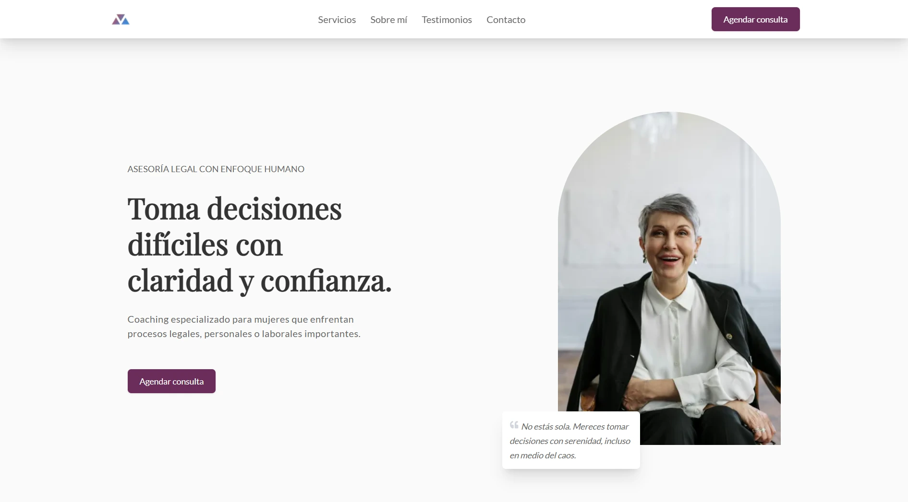

# 💼 Legal Coach - Landing Page

Landing page profesional para una **Coach Legal**, diseñada para presentar sus servicios de asesoría legal con enfoque humano y emocional, especialmente dirigida a mujeres que enfrentan procesos difíciles en sus vidas personales, laborales o legales.



---

## ✨ Características principales

- Diseño limpio y profesional, centrado en la claridad y empatía.
- Secciones bien estructuradas: servicios, sobre mí, testimonios, contacto.
- Formulario funcional para agendar consultas y enviar mensajes.
- Enfoque responsivo y accesible.
- Integración con **Resend API** para envío de correos (modo demostración).

---

## 📌 Secciones incluidas

### 1. **Hero**
> *"Asesoría legal con enfoque humano. Toma decisiones difíciles con claridad y confianza."*

- Llamado a la acción principal: **Agendar consulta**
- Imagen representativa del servicio

### 2. **Servicios**
- **Procesos de Divorcio**: Acompañamiento estratégico y emocional.
- **Conflictos Laborales**: Defensa de derechos con coaching y guía legal.
- **Coaching Personal**: Desarrollo emocional, toma de decisiones, autoestima.

### 3. **Sobre mí**
- Más de 15 años de experiencia.
- 300+ mujeres acompañadas.
- Formación en derecho familiar, laboral y coaching ontológico.

### 4. **Testimonios**
> Historias reales de transformación y empoderamiento de mujeres que confiaron en el acompañamiento de la Coach Legal.

### 5. **Contacto**
- Datos de contacto: teléfono, email y ubicación.
- Formulario de envío de mensaje.
- Consulta gratuita de 30 minutos (CTA final).

---

## ⚙️ Tecnologías usadas

- **Astro** – Framework web moderno para sitios rápidos y estáticos.
- **TypeScript** – Tipado estricto para mayor seguridad.
- **TailwindCSS** – Estilos rápidos y reutilizables.
- **Zod** – Validación de formularios del lado del servidor.
- **Resend API** – Envío de correos electrónicos (modo demo con `delivered@resend.dev`).

---

## 🚀 Instalación local

```bash
# Clona el proyecto
git clone https://github.com/tuusuario/legal-coach-landing.git

# Entra al proyecto
cd legal-coach-landing

# Instala dependencias
pnpm install

# Inicia el servidor de desarrollo
pnpm run dev
